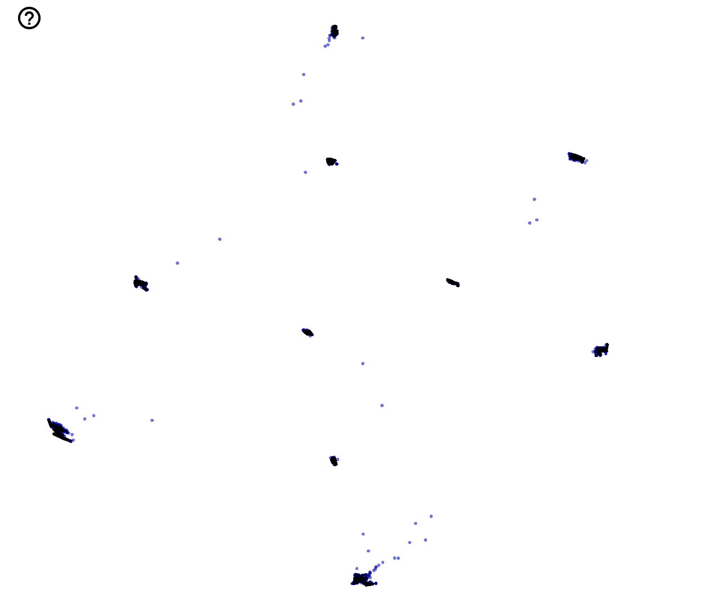

# Deep Embedded Clustering (DEC) in Tensorflow

## Introduction
Deep embedded clustering is a machine learning technique that combines the strengths of deep learning and clustering to automatically group data points based on their intrinsic similarities. Here's the gist:

Deep learning extracts high-dimensional, meaningful representations (embeddings) from your data, capturing underlying patterns and relationships. Imagine it as finding a more informative way to describe each data point beyond its raw features.
Clustering groups similar data points together based on these embeddings. Think of it as organizing your data points into meaningful categories based on their extracted features.


## Training
```sh
usage: train.py [-h] [--batch-size BATCH_SIZE] [--gpu-index GPU_INDEX]

optional arguments:
  -h, --help            show this help message and exit
  --batch-size BATCH_SIZE
                        Train Batch Size
  --gpu-index GPU_INDEX
                        GPU Index Number
```

## Visualized
The `inference.py` returns the latent representation ($z$), and exports the `z.tsv`, `meta.tsv` (label information).
```sh
usage: inference.py [-h] [--gpu-index GPU_INDEX]

optional arguments:
  -h, --help            show this help message and exit
  --gpu-index GPU_INDEX
                        GPU Index Number
```
For visualization, we use t-SNE by importing `z.tsv`, `meta.tsv` into [Tensorboard][tensorboard-url].
The visualization using MNIST shows as follow.

<p align="center">
  
</p>

[dec-arxiv]: https://arxiv.org/pdf/1511.06335.pdf
[tensorboard-url]: https://projector.tensorflow.org
